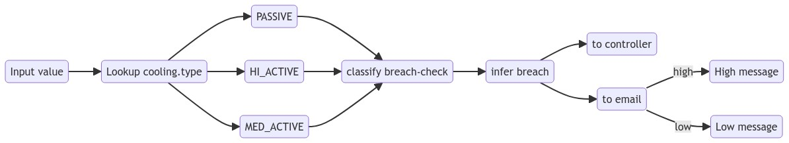

# Infer and Report by type

This assessment is graded by the amount of coverage achieved, in addition to readability and ease-of-change.

The data-flow in the code has several variations:

The code uses switch-case / if-else ladders to implement these variations.

Such structures limit the open-ness of the code,
limiting the possibility of parallel working by multiple developers.
They also require repetitive tests.

Try applying the strategy pattern to make the code more 'open', reducing the amount of tests and repetitions, while increasing the coverage.

## Starting point

Pick a starting point for your assessment.

[C](https://classroom.github.com/a/NNrL9KFC)

[C++](https://classroom.github.com/a/_eph36ll)

[C#](https://classroom.github.com/a/r-2p5RpP)

[Java](https://classroom.github.com/a/XSobgcZT)

[Python](https://classroom.github.com/a/60iD4Nh-)

[JavaScript](https://classroom.github.com/a/ezu5L4dk)
